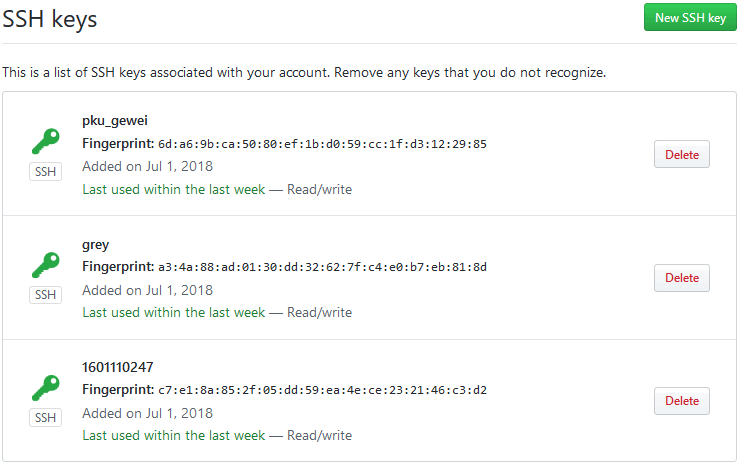

# Git

<!-- TOC -->

- [Git](#git)
    - [Introduction](#introduction)
        - [版本控制](#版本控制)
        - [分布式](#分布式)
        - [git 本地操作](#git-本地操作)
        - [项目开发过程](#项目开发过程)
    - [repository tips](#repository-tips)
        - [仓库迁移](#仓库迁移)
        - [本地的仓库push到多个repo](#本地的仓库push到多个repo)
        - [portable git](#portable-git)

<!-- /TOC -->

## Introduction

`sudo apt install git`, [git documentation](https://git-scm.com/doc)

分布式版本控制系统：分布式、版本控制

### 版本控制

- 一个人写代码的时候，不同时间段的需要有记录(回溯历史)
- 多个人写代码的时候，不同人的需要有记录，而且最后代码要合并

一个人: 在本地编辑完毕之后，提交到本地版本库中去;

多个人：需要一个服务器(一般无机密用github)，每个人提交到本地之后， 再把本地的代码push到github; 大家都完成之后，组长将github的代码pull到本地来；其实每个人都可以将全部代码pull到本地；

所以版本控制器两大功能：
- 历史回溯
- 版本合并

### 分布式

每个人本地都有一个版本库，都可以将github上的拉到本地，那么即便服务器挂了，代码在每个人那里都有副本；

- SVN, CVS: 必须要有中央的服务器; 代码每个人都有，追溯的历史只有服务器上面有; 一旦服务器挂了，回不到旧版本了
- GIT: 每个人既有代码也有追溯历史; github其实可有可无，只是完成多个人协作时，代码的分发

### git 本地操作

```bash
james@ubuntu:~/MyApp$ git config --global user.name "gewei"
james@ubuntu:~/MyApp$ git config --global user.email "gewei@qq.com"
james@ubuntu:~/MyApp$ git init
Initialized empty Git repository in /home/james/MyApp/.git/
james@ubuntu:~/MyApp$ vim hello.txt
james@ubuntu:~/MyApp$ vim world.txt
james@ubuntu:~/MyApp$ git status
On branch master

No commits yet

Untracked files:
  (use "git add <file>..." to include in what will be committed)

        hello.txt
        world.txt

nothing added to commit but untracked files present (use "git add" to track)

# 添加进入本地缓存仓库
james@ubuntu:~/MyApp$ git add *
james@ubuntu:~/MyApp$ git status
On branch master

No commits yet

Changes to be committed:
  (use "git rm --cached <file>..." to unstage)

        new file:   hello.txt
        new file:   world.txt

james@ubuntu:~/MyApp$ git commit -m "add hello.txt and world.txt"
[master (root-commit) 8c800de] add hello.txt and world.txt
 2 files changed, 4 insertions(+)
 create mode 100644 hello.txt
 create mode 100644 world.txt
james@ubuntu:~/MyApp$ git status
On branch master
nothing to commit, working tree clean
# log
james@ubuntu:~/MyApp$ git log
commit 8c800defe27faef686940141db9236493947eee9 (HEAD -> master)
Author: gewei <gewei@qq.com>
Date:   Sun Jul 1 23:17:39 2018 +0800

    add hello.txt and world.txt
# rename
james@ubuntu:~/MyApp$ git mv hello.txt helloGrey.txt
james@ubuntu:~/MyApp$ git status
On branch master
Changes to be committed:
  (use "git reset HEAD <file>..." to unstage)

        renamed:    hello.txt -> helloGrey.txt

james@ubuntu:~/MyApp$ git commit -m "change hello.txt name"
[master 672a7c0] change hello.txt name
 1 file changed, 0 insertions(+), 0 deletions(-)
 rename hello.txt => helloGrey.txt (100%)
james@ubuntu:~/MyApp$ git status
On branch master
nothing to commit, working tree clean
james@ubuntu:~/MyApp$ git log
commit 672a7c0872519af349c5e1576d7855d049f2a3cf (HEAD -> master)
Author: gewei <gewei@qq.com>
Date:   Sun Jul 1 23:19:49 2018 +0800

    change hello.txt name

commit 8c800defe27faef686940141db9236493947eee9
Author: gewei <gewei@qq.com>
Date:   Sun Jul 1 23:17:39 2018 +0800

    add hello.txt and world.txt
# change file content
james@ubuntu:~/MyApp$ vim world.txt
james@ubuntu:~/MyApp$ git status
On branch master
Changes not staged for commit:
  (use "git add <file>..." to update what will be committed)
  (use "git checkout -- <file>..." to discard changes in working directory)

        modified:   world.txt

no changes added to commit (use "git add" and/or "git commit -a")
```

git常用命令:
- 初始化
- `add`
- `mv`
- `rm`
- `clean`
- `checkout`
- `reset`
- 更改
- `diff`
- `commit -m`
- `log`

```bash
# 
```

### 项目开发过程

小组的每一个人在自己的Linux里面`ssh-keygen -t rsa -C "youremail@example.com"`; 

```bash
# member1: pku_gewei@163.com        
moris@ubuntu:~/.ssh$ ls
id_rsa  id_rsa.pub

# member2: gewei@pku.edu.cn
grey@ubuntu:~/.ssh$ ls
# 这是一个密钥对，一个私钥，一个公钥
id_rsa  id_rsa.pub

# member3 1601110247@pku.edu.cn
raphael@ubuntu:~/.ssh$ ls
id_rsa  id_rsa.pub
```

组长在github上面将每个人的`id_rsa.pub`内部的字符串添加`new SSH key`; 其中组长是`pku_gewei`, team一共3个人;



github没有存文件, 只是存了log;

## repository tips

### 仓库迁移

```bash
# 从github到gitlab
# step1: 从github clone一份裸版本库
git clone --bare git@github.com:greying/djangoTest.git
cd djangoTest.git

# step2: gitlab上面创建新的project, 然后push
git push --mirror git@gitlab.com/AlphaGrey/newproject.git

# step3: 删除裸版本库

# step4: 从gitlab clone
git clone git@gitlab.com/AlphaGrey/newproject.git
```

### 本地的仓库push到多个repo

```bash
# 查看remote
$ git remote
origin
$ git remote -v
origin  git@code.aliyun.com:gewei631331/djangoTest.git (fetch)
origin  git@code.aliyun.com:gewei631331/djangoTest.git (push)

# add repo
$ git remote add test git@gitlab.com:AlphaGrey/testApp.git
$ git remote -v
origin  git@code.aliyun.com:gewei631331/djangoTest.git (fetch)
origin  git@code.aliyun.com:gewei631331/djangoTest.git (push)
test    git@gitlab.com:AlphaGrey/testApp.git (fetch)
test    git@gitlab.com:AlphaGrey/testApp.git (push)

# push到gitlab的一个空project
$ git push -u test master
```

### portable git

```bash
# D:\ProgrammingTools\PortableGit\etc\bash.bashrc添加
export HOME="/f/MyData"
# D:\ProgrammingTools\PortableGit\mingw64\etc\gitconfig添加global username, email
[user]
    name = HPGrey
	email = grey@pku.edu.cn
```