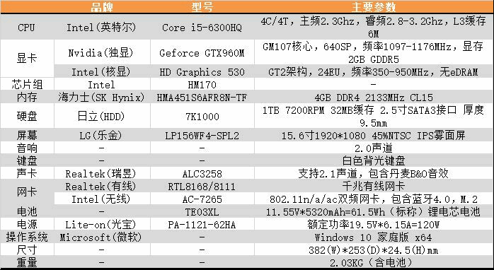

# Markdown Grammar

Now is the time for all good men to come to
the aid of their country. This is just a
regular paragraph.

The quick brown fox jumped over the lazy
dog's back.

- [A First Level Header](#a-first-level-header)
    - [About blockquote](#about-blockquote)
    - [About empahsize](#about-empahsize)
    - [About list](#about-list)
    - [About Link](#about-link)

## About blockquote

> This is a blockquote.
>
> This is the second paragraph in the blockquote.

## About empahsize

Some of these words *italic*.

Use two asterisks for **bold**.

Use three asterisks for ***bold italic***

~~This was mistaken text~~

## About list

- Candy.
- Gum.
- Booze.

1. Red
1. Green
1. Blue

- A list item.

    With multiple paragraphs.
    what the hell!
- Another item in the list.

## About Link

This is an [example link](http://example.com/).

This is an [example link](http://example.com/ "With a Title").

I get 10 times more traffic from [Google][1] than from
[Yahoo][2] or [MSN][3].

[1]: http://google.com/ "Google"
[2]: http://search.yahoo.com/ "Yahoo Search"
[3]: http://search.msn.com/ "MSN Search"

I start my morning with a cup of coffee and
[The New York Times][NY Times].

[ny times]: http://www.nytimes.com/

网址：<https://www.google.com/ncr>

邮件：<vip.gewei@foxmail.com>

## About Picture



![alt text][id]

[id]: res/test.png "Optional Title"

## About the code

Use the `printf()` function.

``There is a literal backtick (`) here.``

A single backtick in a code span: `` ` ``

I wish SmartyPants used named entities like `&mdash;`
instead of decimal-encoded entites like `&#8212;`.

If you want your page to validate under XHTML 1.0 Strict,
you've got to put paragraph tags in your blockquotes:

    <blockquote>
    <p>For example.</p>
    </blockquote>

```cpp
#include <iostream>

int main()
{
    std::cout<<std::endl;
    std::cout<<"what the hello"<<std::endl;
}
```

## About Table

| 表头一 | 表头二 |
| ------ | ------ |
| 内容一 | 内容二 |
| 内容三 | 内容四 |

| 左对齐   | 居中对齐   | 右对齐   |
| :------ | :-------: | ------: |
| 左对齐列 | 居中对齐列 | 右对齐列 |
| 1       | 2         | 3       |

## About Tasklist

- [x] 任务列表1
- [ ] 任务列表2
- [ ] 任务列表3

## About 转义字符

this *literal asterisks*

this \*literal asterisks\*

---

above is a line