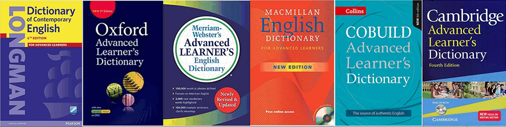
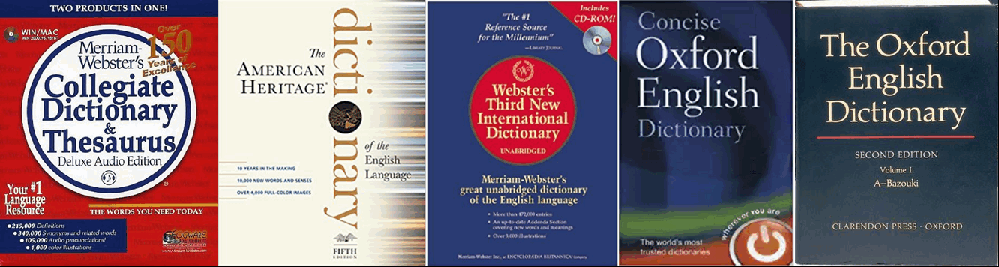

# Golden dictionary tips

[Golden Dictionary Download](https://sourceforge.net/projects/goldendict/files/)

不用 GoldenDict 的 10 个理由
><https://mp.weixin.qq.com/s/HzZZhyyHMb0DpQ4AYOLzlA>

GoldenDict全文搜索
><http://mp.weixin.qq.com/s/gHMJrVG_bmGw142fEEtNeQ>

## MDX

提高英语词汇量

<http://mp.weixin.qq.com/s/Yp_fmZ3pihJlsAAViVZOjg>

En-en dictionary vs en-zh dictionary

<http://mp.weixin.qq.com/s/J6Vz-WgyTgTpOPnKFu7GpA>

LDOCE 5th en-zh

<http://mp.weixin.qq.com/s/I9ZK1kWJoOK02H3kTj4zfA>

Mdx making related

<http://mp.weixin.qq.com/s/YiA4GzSpHjdJXFA3JIJuRg>

Mdx making related2

<http://mp.weixin.qq.com/s/S7Yrqee2lSvdReKnfU5jyQ>

## Dictionary type

## en-zh

pass it

## en-en

### ESL: english as a second language

☑ **(LDOCE)Longman Dictionary of Contemporary English(6th)★★★★★**

☑ **(OALD)Oxford Advanced Learner's Dictionary(9th)★★★★**

(MWALED)Merriam-Webster's Advanced Learner's English Dictionary★★★★

(MED)Macmillan English Dictionary for Advanced Learners★★★★

☑(CCALED)Collins Cobuild Advanced Learner's English Dictionary★★★★★for newfisher)

(CALD)Cambridge Advanced Learner’s Dictionary★★★★

Vocabulary.com

### non-ESL: native

☑ **(MWCD)Merriam-Webster's Collegiate Dictionary★★★★★**

☑ **(AHD)American Heritage Dictionary★★★★**

Webster's Third New International Dictionary★★★★

Concise Oxford English Dictionary(11th)★★★★

(OED)Oxford English Dictionary★★★★★

(SOED)Shorter Oxford English Dictionary(6th)

☑ **(ODE)Oxford Dictionary of English(3rd)**

☑ **(CED)Collins English Dictionary(2016)★★★★★**

☑ **(TCD)the Chambers Dictionary(11th)★★★★**

## 原生英语环境

- **英语原生环境**(这是硬性条件，但是没有也可以英语巨好)
  - 有生存需求，所以经常要使用

- 自己**创造原生英语环境**
  - 英语的学习不依赖于如何学习（语法等）、不依赖于书本、不依赖于培训机构、不依赖于是否留学、而是依赖于原生环境

## 原生环境要素

- 对英语世界的好奇与开放
- 牺牲和放弃已知的语言世界
- 让语言成为辅助过程，为第一目的服务（比如学习photoshop是第一目的）

实际操作：

- 国内的英语学习中心没有卵用
- 越是刻意的去理解语言，越是学不好

## 原则

从文字转移到声音，完全把注意力放在听上面

操作**方法**：

- 任何搬出字典做笔记，把单词写出来，音标标上来统统抛弃；
- 避免声音往文字上面跳，听到后猜测他们在说什么，回到声音上面去，不要做任何笔记，不要对文字产生任何依赖，做到听到同样的声音的时候产生立刻的反应；
- 先按照外国文盲的标准培养语言听觉能力，暂时放弃文字，能够听得懂，说得出来，不知道怎么写，第一个里程碑
- 大脑处理声音信号的能力（声音解码，编码）决定了语言学习的速度，语言识别的能力；
- 不要使用口语，要多听；

## 语言的理解和再生（口语）

声音的解码与文字没有半毛钱关系，声音编码不接受逻辑指令，也就是无法完全重复别人说过的话

>理解：声音信号-声音解码-大脑认知；
>
>再生：大脑认知-声音编码-声音信号；
>
>声音编码器的能力取决于声音解码器，说明听的不多，是不会讲出来的

操作方法：

- 放弃一切逻辑性和条理性的语言学习 ，去钻研英语的逻辑结构，单词的意思，时态没有卵；
- 不要和中国学生比英语能力：比如英语竞赛，英语演讲，英语辩论没什么卵用

找资料：

- 外国人给自己国家用的东西；
- 找一些未经裁剪，以现场录制为主的，采访，家庭视频等等(youtube)，比电视电影更适合语言的习得；
- 模仿外国人看的东西，做他们做的事，你就会变得和他们一样；