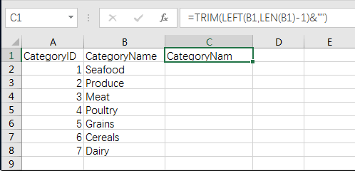
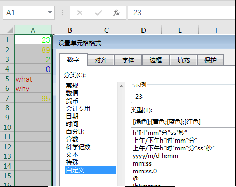
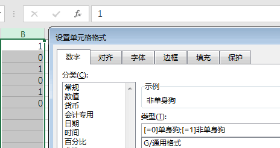

# Excel Tips

<!-- TOC -->

- [Excel Tips](#excel-tips)
    - [Useful tips](#useful-tips)
        - [Column fill](#column-fill)
        - [Remove end space](#remove-end-space)
    - [Cell, Sheet, excel](#cell-sheet-excel)
        - [占位符](#占位符)
    - [Copy & Paste](#copy--paste)
    - [About Print](#about-print)

<!-- /TOC -->

## Useful tips

### Column fill

双击十字架，填充一列

双击A,B,C, 根据内容调节单元格宽度

### Remove end space

1. 利用公式`=TRIM(LEFT(B1,LEN(B1)-1)&"")`

    
1. 下拉十字架，填充

    
1. 复制C列，粘贴到D列（粘贴为值）

    

If you want to mark something as code, indent it by 4 spaces.

## Cell, Sheet, excel

1. 文本、日期靠右，数值靠左(单元格基本类型：文本、数值、日期)
1. 数值、日期可以运算，文本不行(B3-A3)

### 占位符

1. `0` & `#`, 以四舍五入显示，数据大小不变
    - `#`占位，无意义的0不显示(##.##格式的01.00, 显示为1)
    - `0`占位，无意义的0显示(00.00格式的01.00, 显示为01.00)
    - `#"@pku.edu.cn"`，结果为数值类型

        
1. `@`占位符，代替单元格的文本, 结果类型为文本类型
1. 其他占位符：
    - 千分号：`,`
    - 百分号：`%`
    - 时间：`HH:MM:SS`
    - 日期：`YYYY:MM:DD`
1. `;`占位符
    - `正数;负数;0;文本`,这四种类型，四种处理(比如`**;**;**;**`用于简单加密；`;;;;`用于隐藏数据)

        
    - `条件1;条件2`, 针对不同条件处理

        
1. 如果是数值类型，已经通过改变显示格式变成类似文本的的，要变成文本类型，剪切板功能

    

## Copy & Paste

`Shift +Drag` 可以实现图片等比例变形

粘贴为链接，可以同时变很多地方的数据

Excel警告

- `#VALUE!`表示数据类型不对
- `#REF!` 没有参照
- `DIV/0`除以0

快速填充：先自己填充一个单元格，比如1601110241,然后使用快速填充(`Ctrl +E`)

## About Print

如果碰到excel打印出现显示不全的情况

- 调整表格的高度，将其显示出来
- View/PageBreakView可以查看打印的边界，其中的横向或者竖向的线，让整个页面得以显示在**Page One**

出现表格没有占满打印纸的情况

File/Print/Settings/Fit Page on One Page

