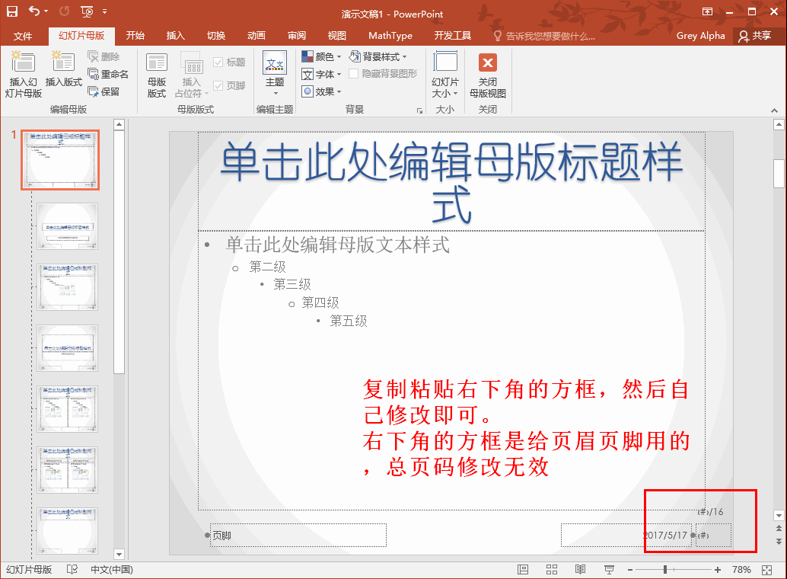

# PPT simeple tips

## PPT lesson

<http://mp.weixin.qq.com/s/QsZFnNWAkfjulh1TfET0gA>

<http://mp.weixin.qq.com/s/BInR8cSSCFSPEh2ds9sdpQ>

## total pages

## Others

设置母版

Logo, 页眉页脚, 指定特殊标记, 标题

快速定位

先按页码，再Enter

黑板B, 白板w, 画笔`Ctrl +p`, 橡皮擦`E`

`file/export/create video`